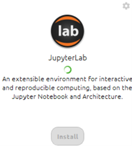
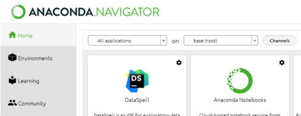
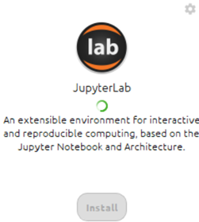
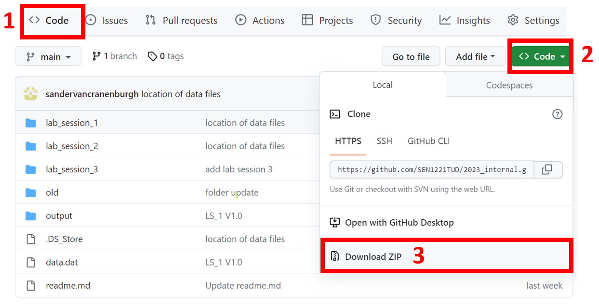
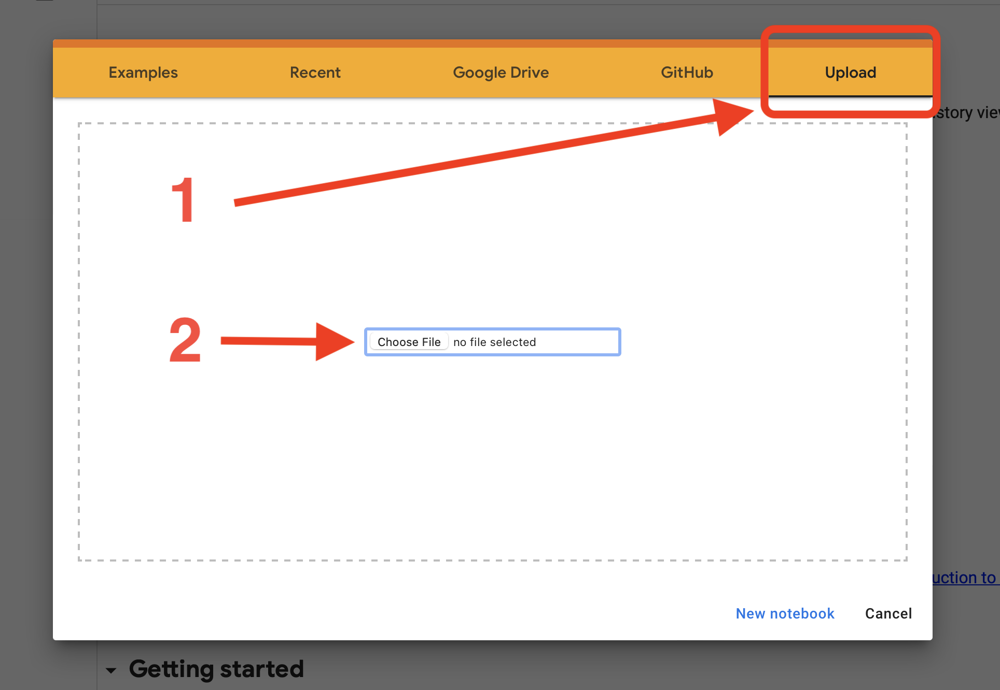

# SEN122A- Statistical Analysis of Choice Behaviour 2024

`Reminder: don't forget to enrol yourself for Partial exam 1 (04/12/2024) via OSIRIS!`

## 1. Introduction

Welcome to the *Choice behaviour modelling* section of the SEN112A course repository. In this repository, you will find Jupyter notebooks for the lab sessions, step-by-step instructions for setting up your Python environment, and a discussion forum where you can ask questions related to the course content.
   

## 2. Course description

Mathematical models of choice behaviour –henceforth referred to as "Discrete Choice Models" (DCMs)– are widely used to study the decision-making behaviour of individuals across numerous domains, including transportation, marketing, and health. DCMs are used to infer preferences over attributes and alternatives and predict the impact of new policies.

This course aims to equip students in the socio-technical domain with a comprehensive understanding of DCMs. You will learn the theoretical underpinnings of choice models and gain practical hands-on experience in estimating and applying these models to solve real-world problems.  

The course consists of oral lectures and lab sessions. During the lab sessions, students will work with Python-based tools to estimate models and analyze datasets. Attendance at both the lectures and lab sessions is highly recommended to keep up with the course content, although it is not mandatory.

Below, you can find the dates for the lab sessions and the partial exams:

| **Event**             | **Date**           | **Time**       |
|-----------------------|--------------------|----------------|
| First lab session (MNL)    | November 15, 2024   | 13:45 PM        |
| Second lab session (MXL)    | November 22, 2024   | 13:45 PM        |
| Third lab session (ML)    | November 29, 2024   | 13:45 PM        |
| Partial Exam        | December 4, 2024   | 10:45 AM       |
| Resit partial Exam  | January 15, 2025   | 10:45 AM       |

Please review the information below carefully.

## Lab sessions
Lab sessions are offered in the form of Jupyter notebooks and aim to demonstrate and reinforce knowledge about discrete choice models, the underlying assumptions, estimation techniques, and how to interpret outcomes. They provide **hands-on** experience in discrete choice modelling, which is essential to master the method. Each lab session comprises two parts: A and B, and include a series of **exercises**.

`Lab session 1` introduces discrete choice models, focusing specifically on the Multinomial Logit (MNL) model based on random utility theory. You will acquire skills to explore choice datasets, build and estimate choice models using specialised Python package called Biogeme, and perform statistical tests to compare different model specifications.

`Lab session 2` focuses on the Mixed Logit models. You will gain proficiency in building and estimating various types of Mixed Logit models by altering assumptions about unobserved preference and taste heterogeneity. Furthermore, you will explore the impact of the number of draws on the estimation outcomes. 

`Lab session 3` focuses on the latest developments in the field: combining discrete choice modelling and machine learning for choice behaviour analysis. You will work with neural networks and explore how they can be integrated within utility-based choice models.   

For the lab sessions, we use Python notebooks (aka Jupyter Notebooks). You have three options to work with them. 
A. Anaconda (local)
B. Pip (local)
C. Google Colab (cloud-based)
For each option, **instructions** to set up your Python environment are given at the **end of this page**.

If you are **unfamiliar with Python**, we recommend completing **lab session 0**, which provides the necessary tools to conduct the lab sessions. It covers topics such as data structures, utilising external libraries, data exploration, visualisation, etc. 

## Tutorials
Tutorials are supplementary materials, offered to help you deepen your understanding of key concepts in choice modelling. These ([tutorials](https://github.com/SEN1221TUD/Tutorials)) aim to reinforce your understanding of the topics covered. They do not contain exercises, but are part of the SEN122A course material. 

Here, you will find tutorials. Tutorials aim to explain concepts that are important to choice modelling. The current list of topics is:

[Tutorial 1](https://github.com/SEN1221TUD/Tutorials/blob/main/tutorial1/tutorial1_DGP_and_bias.ipynb): The data generating process and bias  
[Tutorial 2](https://github.com/SEN1221TUD/Tutorials/blob/main/tutorial2/tutorial2_The_loglikelihood_function.ipynb): The loglikelihood function 
[Tutorial 3](https://github.com/SEN1221TUD/Tutorials/blob/main/tutorial3/tutorial3_concave_likelihood_MNL.ipynb): The concave likelihood function of the linear-additive RUM-MNL model 
[Tutorial 4](https://github.com/SEN1221TUD/Tutorials/blob/main/tutorial4/tutorial4_Local_vs_global_maxima.ipynb): Local versus global maxima 
[Tutorial 5](https://github.com/SEN1221TUD/Tutorials/blob/main/tutorial5/tutorial5_Ignoring_panel_structure.ipynb): The impact of ignoring the panel structure of choice data 
[Tutorial 6](https://github.com/SEN1221TUD/Tutorials/blob/main/tutorial6/tutorial6_Expected_max_utility.ipynb): The expected maximum utility and the LogSum formula 

The list of tutorials may be further extended in the future.

## 4. Q&A forum

We use the [Issues](https://github.com/SEN1221TUD/Q2_2024/issues) section as the Q&A platform of this course (Part 1: Choice Behaviour Modelling). This is where you can post questions related to lecture content, lab sessions, or technical issues with Python. Before you create a new issue, please make sure that the same question hasn’t already been raised by one of your peers. You can also contribute to ongoing discussions by commenting on existing issues to continue the conversation or provide additional insights. As an example, we have already created the first issue; see [Issues](https://github.com/SEN1221TUD/Q2_2024/issues).

To create a new issue (question or problem) in the course repository, follow these steps:

1. Go to the "Issues" section of the course repository.
2. Click on "New issue" in the green button located at the upper right corner of your screen.
3. Add an informative title to your question or problem (e.g., "logit model of BIOGEME does not import in my notebook").
4. Describe your issue clearly and concisely. 
5. Add a topic label from the right-hand side. Click on the gear icon next to "Labels" and choose the label based on the topic of your question. 
6. Click on "Submit new issue" in the green button below the text description.

After that, the lecturer or teaching assistant will reply to your question. Also, you are encouraged to reply to questions posted by your fellow students! If you know how to help your fellow student with an issue, share your thoughts!

## 5. Instructions to set up your workspace

In this section, we will guide you through the configuration of your Python environment for the Choice Behaviour Modelling part of the course. You have three options for setting up your environment: Anaconda, PIP or Google Colab. We recommend using Anaconda.

### A. Setting up with Anaconda

Anaconda is a popular platform for managing Python environments. If you’re using Anaconda, it’s recommended to use Python version **3.12.7, 3.11.10, or 3.10.15** to avoid compatibility issues. Other versions, such as **3.9 or  older**, are known to give problems.

Step-by-Step Instructions:

#### Instruction 1: Creating your Python environment in Anaconda
0. **Install Anaconda**: 

   * Go to the [Anaconda download page](https://docs.anaconda.com/anaconda/install/).
   * Choose the appropriate version and click Download.
   * Run the installer and follow the  instructions.

1. **Open Anaconda Navigator**: Go to the “Environments” tab on the left sidebar of the Anaconda Navigator.
   

2. **Create a new environment:** Click on the "Create" button at the bottom of the window.

    
   
3. **Name your environment and choose Python version**: Enter a name for your new environment (e.g., SEN122A) and select Python version 3.12.7 from the drop-down menu.

    
   
4. **Activate the environment:** Go to the “Home” tab in Anaconda Navigator. You should see your newly created environment on the right side. Select it and launch Jupyter Notebook or JupyterLab from here.
 
   

5. **Download and set up the course materials:** Download the SEN122A course repository from GitHub. Unzip the file into a working directory of your choice. Inside, you’ll find Jupyter notebooks, a requirements.txt file, and datasets.

6. **Launch JupyterNotebook or JupyterLab and find your workspace**: You will see the Lab session, the `requirements.txt` file, and the `data` folder.

   
 
   
   
7. **Import packages:** Once inside the notebook, locate the requirements.txt file and uncomment the necessary lines in the provided setup code. Run the cells to import all required packages. If some packages fail to install, restart the kernel and rerun the commands.

   

8. **Import all packages:** Run the cells to import all required packages. 
 
   
   
   If some packages fail to install, restart the kernel and repeat steps: 7 and 8
 
   

9. **Run the notebook**: Once the setup is complete, you’re ready to run your code. The required packages will be installed, and you can proceed with the lab session.
   
#### Instruction 2: Create environment and install the requirements through the terminal.

If you prefer using the terminal to manage your environment:

1.	Open Anaconda Terminal: Click the green play button next to your environment name in the “Environments” tab to open a terminal.

      

2. **Create a new environment:** Click on the "Create" button at the bottom of the window.

   

3. **Configure the new environment:** Enter a name for your new environment, e.g., "SEN122A," and choose the Python version == “3.12.7" from the drop-down menu.

   

4. **Activate the environment:** Click on the green "Play" button on the right side of the environment name to open a terminal where the environment is activated.

   

5. **Verify Python version:** You can run `python --version` in the terminal.

   

6. **Navigate to the project folder:** Use the `cd` command to navigate to the project folder, for example, `cd …/…/…/Q2_2024`.

   

7. **Install requirements file:** Now, you can install the `requirements.txt` file within the activated environment using the following command: `pip install -r requirements.txt`

   
  
8. **Install and launch JupyterNotebook/JupyterLab**

   
   
9. **Import all packages**

   

10. **Run the notebook**: Once the setup is complete, you’re ready to run your code. The required packages will be installed, and you can proceed with the lab session.

### B. Setting up with PIP (Python Package Manager)

If you’re not using Anaconda, you can set up your environment using PIP, which is the default package manager for Python.

Step-by-Step Instructions:

1. **Ensure you have Python 3.10 or higher:** Confirm you have Python installed on your system (version 3.10 to 3.12 is recommended). You can check your Python version by running python --version in your terminal. Additionally, ensure you have set up an IPython environment on your computer (Jupyter, VSCode, or any alternatives). 

2. **Clone or download the repository:** Download the course repository from GitHub. Unzip it into a working folder.
3. **Install requirements:**  Now you have two options: (a) Install dependencies separate from your current Python version; (b) Install dependencies for this notebook in your Python version (easy way):
   
    * Option a: (for those familiar with Python environments):
        * Open your terminal and navigate to the course folder.     
        * Create a new "virtual environment" (a separate workspace for this course).
        * Install the required packages listed in the requirements.txt file within this environment.

                         
    * Option b: (easiest way; for people unfamiliar with Python environments):
        * Open the Python notebook you want to work on (Step 1)
        * Uncomment the line related to using a local set-up and run it (see the figure below).
        * Re-comment the lines to avoid re-installing the dependencies every time you run the notebook.
          

    * Instructions for creating a new virtual environment (if choose option a):
        * Open your command prompt or terminal.
        * Navigate to the directory where you want to create the environment.
        * Type: python -m venv myenv (Replace myenv with a name you choose for your environment).
        * Activate the environment (on Windows, type: myenv\Scripts\activate, on MacOS/Linux, type: source myenv/bin/activate).
        * Install requirements from a File. With your environment activated, navigate to the folder containing the requirements.txt file and run: pip install -r requirements.txt.

4. **Open the notebook**: Launch Jupyther Notebook, JupyterLab, or another IPython tool (e.g., VSCode), and make sure you’re running the notebook inside the newly created virtual environment.

### Setting up with Google Colab

Google Colab is a free, cloud-based platform that allows you to run Python code in a Jupyter-like environment without installing anything locally. You will need a Google account and a stable internet connection.

Step-by-Step Instructions:

1. **Download the repository**: Go to the course GitHub repository and download it by clicking the green “Code” button and selecting “Download ZIP.” Unzip this file into a working folder of your own choice. (See numbers 1, 2, and 3 on the following image).
  
   

2. **Open Google Colab**: Navigate to Google Colab and sign in with your Google account. http://colab.research.google.com

3. **Upload the notebook**: Click on “Upload” in Colab, then “Choose file,” and select the Python notebook (.ipynb) you want to work on from your downloaded folder. See numbers 1 and 2 in the figure below. Then, navigate to your working folder (Step 1) and select the Python notebook (.ipynb) you want to work on (e.g. lab_session_00.ipynb).
   
   
  
4. **	Expand Sections:** Once open, click on "View" >> "Expand sections" on the menu bar.

5. **Prepare the environment:** Each notebook contains cells for preparing the environment in Colab. Locate these cells (usually at the top of the notebook), uncomment the setup lines related to Google Colab (remove the #), and run the cell to install the required packages. See the figure below. Run this cell and wait until finished.

   

6. **Run the notebook**: Once the setup is complete, you’re ready to run your code in Colab. The required packages will be installed, and you can proceed with the lab session. Ignore warning messages that appear during package installation.

Important Notes:

•	Colab provides limited computing power, so for large datasets or complex computations, it’s recommended to download the notebooks and run them locally.
•	The requirements.txt file might be updated during the course, so keep an eye on repository updates.
   

